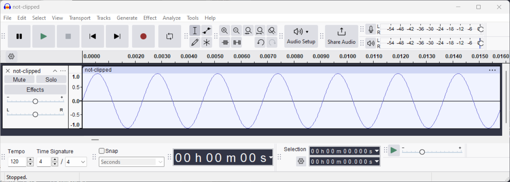
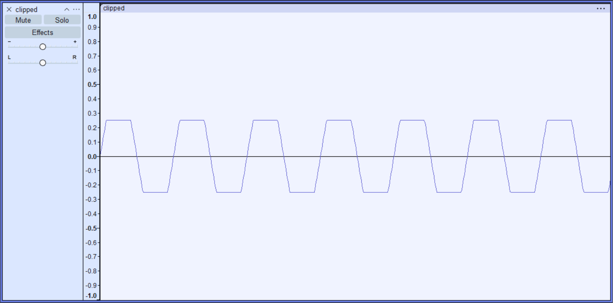

# Table of Contents
- [Table of Contents](#table-of-contents)
- [Note to reader](#note-to-reader)
- [10/13/2024 - 2pm - Working on and finishing hw1](#10132024---2pm---working-on-and-finishing-hw1)
- [10/13/2024 - 1:30pm - Saying "Hi"](#10132024---130pm---saying-hi)
- [10/6/2024 - 3pm - Setting Up for Class](#1062024---3pm---setting-up-for-class)

# Note to reader
The table of contents are in order from newest entry to oldest. That is 
the newest entries are at the top of the table of contents while the 
oldest is at the bottom.

Table of contents are generated using a VSCode extension called 
"Markdown All In One." Very useful tool.

# 10/13/2024 - 2pm - Working on and finishing hw1
- Setup using jupyter notebook
- Installed scipy, sounddevice, and libportaudio2
- set timespace variable t
  - from 0 to 1
  - number of samples to generate (sample rate * frequency)
- use that to generate a sine wave from -1 to 1 using floats
- Convert to 16 bit signed ints (`sine16 = np.int16(sine_wave * max16)`)
- Write to `not-clipped.wav` using `scipy.io.wavfile.write`
- Here is a screenshot of what the `non-clipped.wav` looks like:

- Using `numpy.clip(sine16//2, -8192, 8192)` you can quickly create a 
clipped version. That looks like this and matches the assignment:

- If need be, I can make this into a quick and simple python script, but I
am using a python `venv` and Jupyter notebook with a `requirements.txt`

# 10/13/2024 - 1:30pm - Saying "Hi"
- Just said "Hi". I'm not quite sure what to expect from this course 
so I just do not have much to say at this time.

# 10/6/2024 - 3pm - Setting Up for Class
- Just setting up for the class.